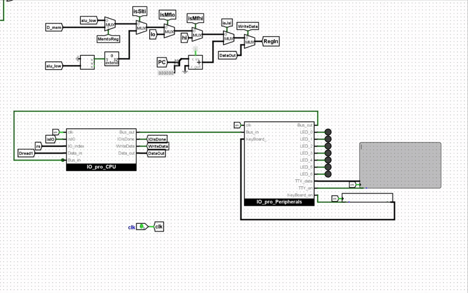
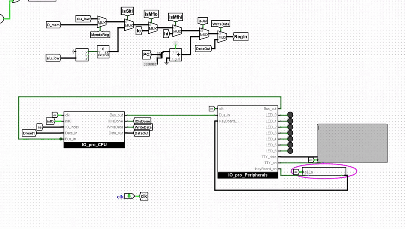
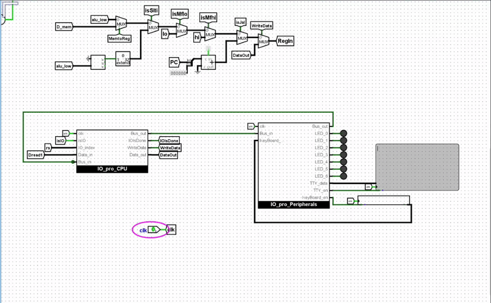
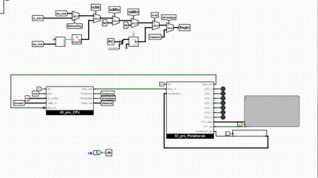

# MIPS Communication With IO By UART Protocol In Logisim

A custom UART-inspired serial communication protocol implementation for a single-cycle MIPS processor in Logisim, enabling I/O device synchronization.

## Project Overview

This project implements:
- A simplified UART-like protocol for MIPS processors
- Hardware-level synchronization between:
  - Keyboard input
  - TTY text display 
  - LED output
- Custom MIPS instructions for I/O operations
- Serial data transfer using shift registers

## Key Features

- Added LED, TTY, and KB operations to MIPS ISA 
- MIPS-I/O communication
- Ready to run tests

## Examples

- Fibonacci test

- KeyBoard test

- Led On Off test

- Shell test!

