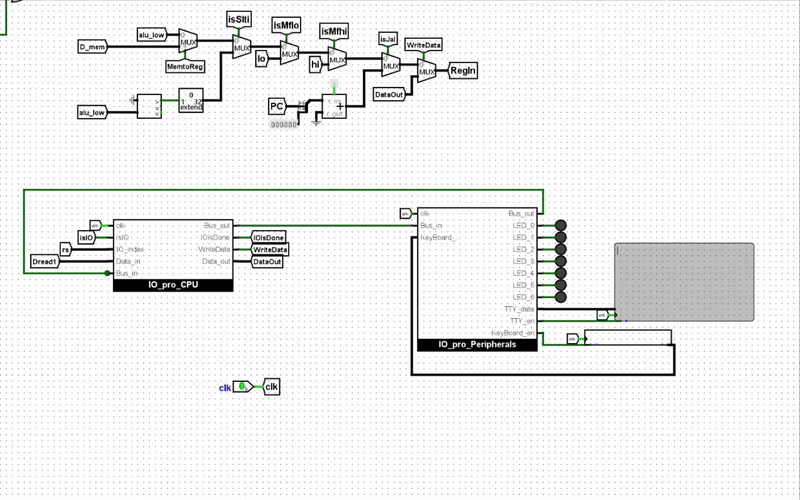
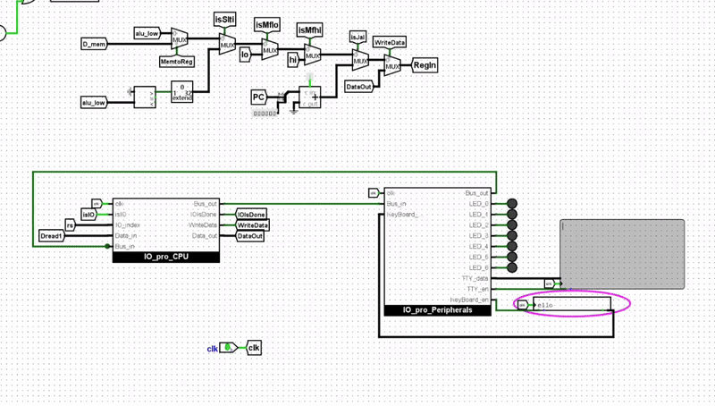
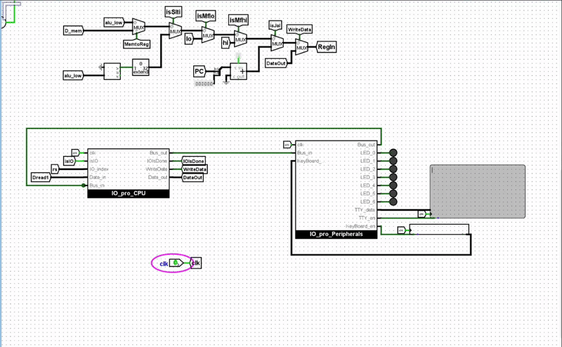
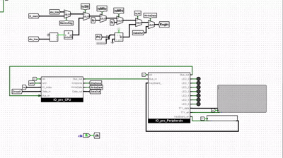

# MIPS Communication With IO By UART Protocol In Logisim

A single-cycle MIPS processor built in Logisim with custom ISA extensions and a UART-inspired serial protocol for talking to a keyboard, an LED array, and a TTY display.

## What it does

- Extends the base MIPS instruction set with dedicated I/O instructions (`led`, `tty`, `kb`) alongside the standard ALU/branch/memory instructions.
- Implements shift-register-based serial transfer to synchronize the CPU with external devices, rather than memory-mapped I/O.
- Test programs are hand-assembled to raw binary and run directly on the circuit: a Fibonacci sequence displayed on LEDs, character output to a TTY, reading a full word typed on a keyboard, and a small interactive shell built entirely out of these primitives.

## Tech stack

Logisim (schematic and simulation), hand-assembled MIPS machine code (no assembler, binary written directly with comments).

## Getting started

Open `schematic.circ` in Logisim, load one of the test programs from `tests/` into instruction memory, and run the simulation.

## Demos

Fibonacci test:

Keyboard test:

LED on/off test:

Shell test:

## Report

Full write-up: [LaTeX report](https://latex.sharif.edu/read/fsjxgtxcnrzk)

## License

MIT — see [LICENSE](LICENSE).
